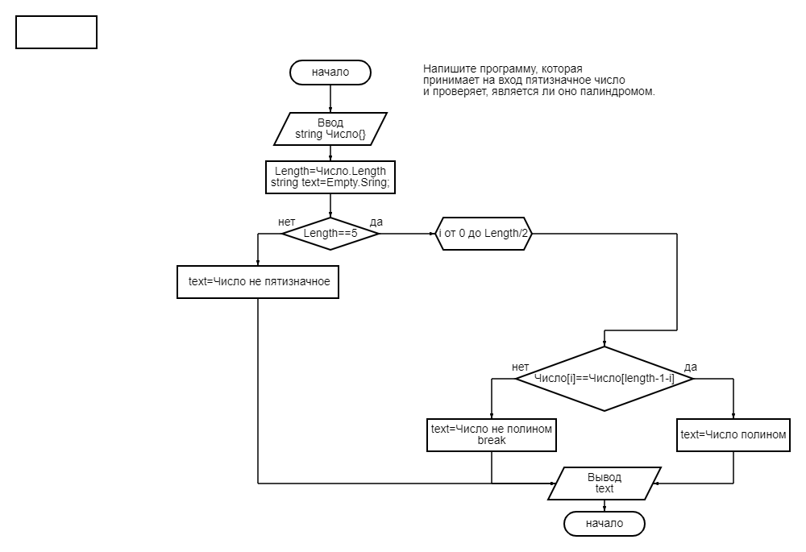
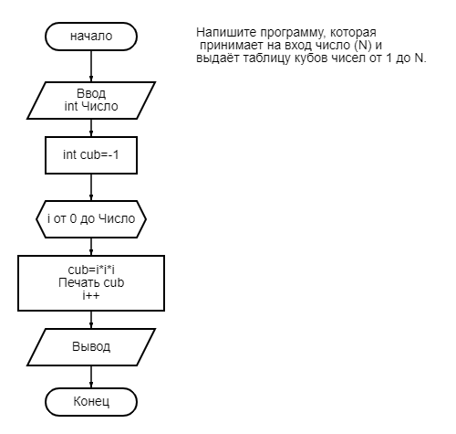

## Задача.1

Напишите программу, которая принимает на вход пятизначное число и проверяет, является ли оно палиндромом.

14212 -> нет

12821 -> да

23432 -> да

  |  ["Код_C# №1"](Exp001_Palinom\Program.cs)

## Задача №2

Напишите программу, которая принимает на вход число (N) и выдаёт таблицу кубов чисел от 1 до N.

3 -> 1, 8, 27

5 -> 1, 8, 27, 64, 125

|["Код_С# №2"](Exp002_CubOFn\Program.cs)